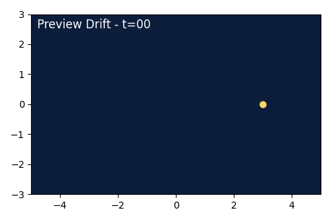

File Summary:
- Project overview README introducing driftcast capabilities and workflows.
- Includes quickstart instructions, animation guidance, and scaling tips.
- Embeds preview media and links to further documentation.

# **Driftcast: Synthetic North Atlantic Plastic Drift Simulator**

Driftcast delivers a reproducible research and storytelling toolkit that simulates idealized surface plastic transport across the North Atlantic, drives configurable particle sources, and renders competition-ready animations with clear attribution and documentation.

## 10-minute Quickstart
A reproducible judge-ready build now takes a handful of commands. Expect roughly ten minutes on a laptop with a modern CPU.

1. Create the environment and install tooling:
   ```bash
   make env
   conda activate driftcast
   pip install -e .
   make precommit
   ```
2. Generate mock processed inputs and normalized crowd observations:
   ```bash
   make data
   ```
3. Run the default subtropical gyre scenario, verify reproducibility, and render the preview cut:
   ```bash
   make run
   make preview
   ```
4. Package the judge deliverables (final MP4, hero PNG, one-pager PDF) and capture absolute paths from the console:
   ```bash
   make judge
   ```
5. Inspect docs and notebooks for deeper dives (`site/index.html` after `make docs`).



## Rendering the Final MP4

1. Ensure FFmpeg is installed (Conda package `ffmpeg` or system installation).
2. Tweak scenario parameters in `configs/natl_coastal.yaml` (windage, Kh, seed counts).
3. Invoke the final-cut renderer or the end-to-end judge workflow:
   ```bash
   driftcast animate final --config configs/natl_coastal.yaml --seed 42
   driftcast judge --config configs/natl_subtropical_gyre.yaml --seed 42
   ```
4. Review the resulting 1080p H.264 MP4, hero PNG (`results/figures/hero.png`), and `docs/onepager.pdf`.
5. Adjust style options in `driftcast/viz/style.py` as needed for competition polish.

## Scaling Up with Dask

- For parameter sweeps on a laptop, use:
  ```bash
  driftcast sweep --config configs/natl_shipping.yaml --param physics.diffusivity_m2s=5,10,20 --param physics.windage_coeff=0.01,0.015
  ```
- To run remotely, start a Dask scheduler (e.g., `dask scheduler`) and point Driftcast to it:
  ```bash
  driftcast sweep --config configs/natl_subtropical_gyre.yaml --param physics.diffusivity_m2s=5,15 --cluster tcp://scheduler:8786
  ```
- Adjust chunk sizes in `SimulationConfig.output.chunks` for large ensembles.

## Performance Spot Checks

Run a deterministic five-second benchmark to record approximate frames-per-second and peak memory usage:
```bash
driftcast perf check --config configs/natl_subtropical_gyre.yaml --seed 123
```

## From Synthetic Fields to Reanalysis

- Velocity fields are currently analytic gyres defined in `driftcast/fields/gyres.py`. Replace with reanalysis data by swapping in gridded `xarray.Dataset` lookups inside `gyre_velocity_field`.
- Synthetic winds and Stokes drift live in `driftcast/fields/winds.py` and `driftcast/fields/stokes.py`. Plug in ERA5 or WaveWatch III slices with identical function signatures.
- Crowdsourced ingest validates submissions against `schemas/crowd_drifters.schema.json`; use `driftcast ingest validate --json <file>` before `driftcast ingest normalize` to keep the parquet archive clean.

## Attribution and References

- Built by the Oceans Four Driftcast team for the Illinois Tech Grainger Computing Innovation Prize.
- Inspiration and future interoperability: [Parcels](https://oceanparcels.org) and [PlasticParcels](https://github.com/OceanParcels/plastic-parcels).
- Initial planning and CS architecture materials were consolidated from the legacy `AI/` and `cs/` directories into this cohesive package.
